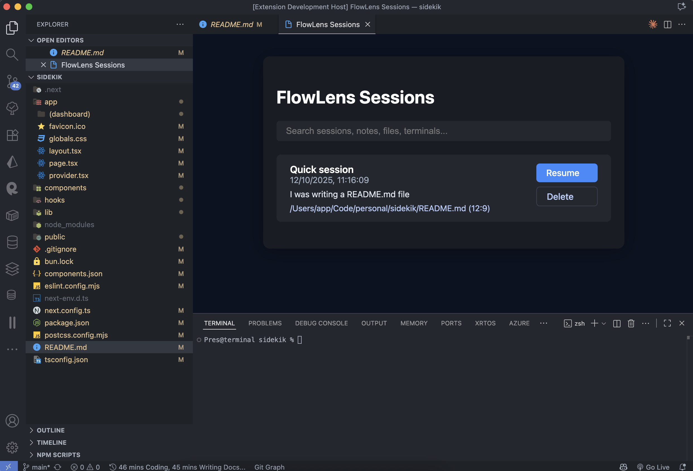
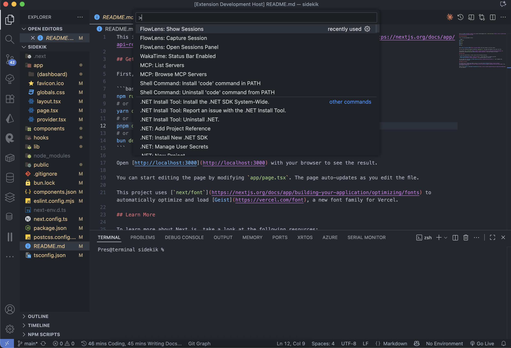
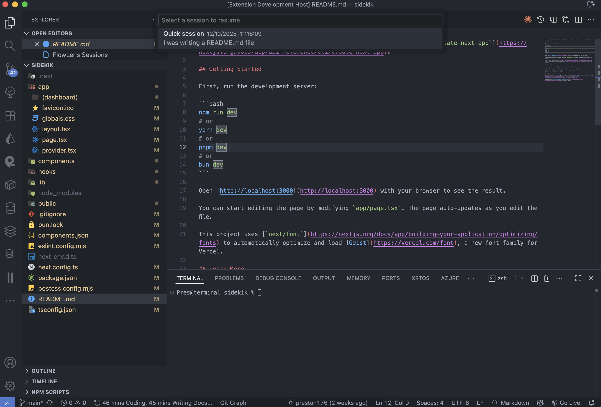

# FlowLens

[](https://marketplace.visualstudio.com/items?itemName=preston176.flowlens)
[](https://marketplace.visualstudio.com/items?itemName=preston176.flowlens)
[](./LICENSE)

A context-aware session management extension for VS Code that captures and restores your complete development environment—open editors, terminal state, git context, and cursor positions.

**Links:** [Marketplace](https://marketplace.visualstudio.com/items?itemName=preston176.flowlens) | [Website](https://flowlens-vscode.vercel.app) | [Security](./.docs/SECURITY.md) | [Contributing](./.docs/CONTRIBUTING.md)

**Links:** [Marketplace](https://marketplace.visualstudio.com/items?itemName=preston176.flowlens) | [Website](https://flowlens-vscode.vercel.app) | [Security](./.docs/SECURITY.md) | [Contributing](./.docs/CONTRIBUTING.md)

---

## Table of Contents

- [Overview](#overview)
- [Architecture](#architecture)
- [Installation](#installation)
- [Usage](#usage)
- [Session Data Model](#session-data-model)
- [Configuration](#configuration)
- [API & Extension Points](#api--extension-points)
- [Development](#development)
- [Roadmap](#roadmap)
- [License](#license)

---

## Overview

FlowLens addresses context switching overhead by persisting workspace state as atomic snapshots. Each session captures:

- Editor state (open files, cursor positions, scroll offsets, selections)
- Terminal state (active shells, working directories, command history)
- Git context (branch, commit SHA, dirty state)
- Workspace metadata (folders, settings overrides)
- User annotations (notes, tags, timestamps)

The extension operates entirely offline by default. No code content is transmitted—only filesystem paths and metadata are stored locally in VS Code's GlobalState.

### Key Features

- **Zero-configuration capture**: Snapshot current workspace state with a single command
- **Intelligent restore**: Reopens files, recreates terminals, and checks out git branches atomically
- **Privacy-first**: All data stored locally; optional sync is E2E encrypted
- **Conflict detection**: Warns when restoring sessions with git conflicts or missing files
- **Analytics dashboard**: Track context switching costs and productivity patterns

---

## Architecture

```
┌─────────────────────────────────────────────────────────────┐
│                       VS Code Extension                      │
├─────────────────────────────────────────────────────────────┤
│                                                               │
│  ┌──────────────┐  ┌──────────────┐  ┌──────────────┐      │
│  │   Commands   │  │   Services   │  │   Webview    │      │
│  ├──────────────┤  ├──────────────┤  ├──────────────┤      │
│  │ Show         │  │ Storage      │  │ Dashboard    │      │
│  │ Dashboard    │─▶│ Analytics    │─▶│ (Embedded)   │      │
│  │ Share        │  │ EditorSvc    │  │              │      │
│  └──────────────┘  │ GitSvc       │  └──────────────┘      │
│                     │ WorkspaceSvc │                         │
│                     └──────────────┘                         │
│                            │                                 │
│                            ▼                                 │
│                  ┌──────────────────┐                        │
│                  │  VS Code APIs    │                        │
│                  ├──────────────────┤                        │
│                  │ workspace.*      │                        │
│                  │ window.*         │                        │
│                  │ scm.*            │                        │
│                  │ ExtensionContext │                        │
│                  └──────────────────┘                        │
│                            │                                 │
└────────────────────────────┼─────────────────────────────────┘
                             ▼
                  ┌──────────────────┐
                  │  GlobalState     │
                  │  (Local Storage) │
                  └──────────────────┘
```

### Component Breakdown

| Component            | Responsibility                                          |
| -------------------- | ------------------------------------------------------- |
| `StorageService`     | Session CRUD operations via GlobalState API             |
| `EditorService`      | Captures/restores editor state (files, cursors, layout) |
| `GitService`         | Git integration (branch detection, checkout)            |
| `WorkspaceService`   | Workspace folder management                             |
| `AnalyticsService`   | Session metrics and productivity calculations           |
| `AutoCaptureService` | Automatic session capture on branch switch, idle, etc.  |

---

## Installation

### From Marketplace

```bash
code --install-extension preston176.flowlens
```

### From Source

```bash
git clone https://github.com/preston176/flowlens-vscode-extension.git
cd flowlens-vscode-extension
npm install
npm run compile
code --install-extension builds/flowlens-0.1.4.vsix
```

### Requirements

- VS Code >= 1.104.0
- Git (optional, for branch tracking)

---

## Usage

### Available Commands

FlowLens provides three primary commands accessible via Command Palette (`Cmd+Shift+P`):

| Command                    | Description                                               |
| -------------------------- | --------------------------------------------------------- |
| `FlowLens: Show Sessions`  | Quick picker to browse and restore sessions               |
| `FlowLens: Open Dashboard` | Web-based dashboard with analytics and session management |
| `FlowLens: Share Session`  | Export session metadata as shareable JSON                 |

**Note:** Keyboard shortcuts are not preconfigured to avoid conflicts. Map them manually via `Preferences: Open Keyboard Shortcuts`.

### Basic Workflow

1. **Capture a session**:

   - Open Dashboard → "Capture New Session"
   - Enter a descriptive title
   - Optionally add context notes

2. **Resume a session**:

   - Run `Show Sessions` or open Dashboard
   - Select a session from the list
   - All files, terminals, and git state will be restored

3. **Share a session**:
   - Run `Share Session`
   - Select target session
   - JSON export created in workspace root

### Auto-Capture (Optional)

FlowLens can automatically capture sessions on:

- Git branch switches
- Workspace folder changes
- Idle timeout (configurable threshold)

Configure in Settings (`flowlens.autoCapture.*`).

---

## Session Data Model

Sessions are serialized as JSON and stored in VS Code's GlobalState. No code content is persisted—only references and metadata.

### Schema

```typescript
interface SessionSnapshot {
  id: string; // Unique identifier
  title: string; // User-provided title
  timestamp: number; // Unix timestamp (ms)
  notes?: string; // Optional annotations

  editors: Array<{
    path: string; // Absolute file path
    cursor: {
      line: number; // 0-indexed
      character: number; // 0-indexed
    };
    selection?: {
      start: Position;
      end: Position;
    };
    scrollOffset?: number;
  }>;

  terminals: Array<{
    id: string; // Terminal identifier
    cwd: string; // Working directory
    lastCommand?: string; // Most recent command
  }>;

  git: {
    branch: string; // Active branch name
    commit: string; // HEAD commit SHA
    isDirty: boolean; // Uncommitted changes
  };

  workspace: {
    folders: string[]; // Workspace folder paths
    name?: string; // Workspace name
  };

  metadata: {
    captureTime: number; // Milliseconds to capture
    fileCount: number;
    terminalCount: number;
  };
}
```

### Storage Location

- **Local**: `~/.config/Code/User/globalStorage/preston176.flowlens/sessions.json`
- **Encrypted sync** (planned): E2E encrypted, stored in user-controlled backend

---

## Configuration

All settings are prefixed with `flowlens.*`:

```json
{
  "flowlens.autoCapture.enabled": true,
  "flowlens.autoCapture.onBranchSwitch": true,
  "flowlens.autoCapture.onIdleTime": false,
  "flowlens.autoCapture.idleMinutes": 30,
  "flowlens.autoCapture.onWorkspaceFolderChange": true,
  "flowlens.autoCapture.maxPerDay": 20,
  "flowlens.analytics.trackUsage": true
}
```

### Configuration Options

| Setting                               | Type    | Default | Description                           |
| ------------------------------------- | ------- | ------- | ------------------------------------- |
| `autoCapture.enabled`                 | boolean | `true`  | Enable automatic session capture      |
| `autoCapture.onBranchSwitch`          | boolean | `true`  | Capture when switching git branches   |
| `autoCapture.onIdleTime`              | boolean | `false` | Capture after idle period             |
| `autoCapture.idleMinutes`             | number  | `30`    | Idle threshold (5-120 minutes)        |
| `autoCapture.onWorkspaceFolderChange` | boolean | `true`  | Capture when workspace folders change |
| `autoCapture.maxPerDay`               | number  | `20`    | Maximum auto-captures per day (5-100) |
| `analytics.trackUsage`                | boolean | `true`  | Track local usage metrics             |

---

## API & Extension Points

FlowLens does not currently expose a public API for other extensions. This is planned for v0.2.0.

### Planned Extension Points

- `flowlens.onSessionCapture`: Event hook for custom capture logic
- `flowlens.onSessionRestore`: Event hook for post-restore actions
- `flowlens.registerSessionProvider`: Allow custom storage backends

---

## Development

### Build from Source

```bash
# Install dependencies
npm install

# Compile TypeScript and bundle
npm run compile

# Watch mode for development
npm run watch

# Run tests
npm test

# Create VSIX package
npm run package
vsce package
```

### Project Structure

```
flowlens-vscode-extension/
├── src/
│   ├── extension.ts              # Extension entry point
│   ├── commands/                 # Command implementations
│   │   ├── openDashboard.ts
│   │   ├── showSessions.ts
│   │   └── sharingCommands.ts
│   ├── services/                 # Core business logic
│   │   ├── StorageService.ts
│   │   ├── EditorService.ts
│   │   ├── GitService.ts
│   │   ├── WorkspaceService.ts
│   │   ├── AnalyticsService.ts
│   │   ├── SmartNamingService.ts
│   │   └── AutoCaptureService.ts
│   ├── models/
│   │   └── SessionSnapshot.ts
│   └── test/
├── dist/                         # Compiled output
├── builds/                       # VSIX packages
├── docs/                         # Documentation
├── demo/                         # Demo automation scripts
└── package.json
```

### Testing

```bash
# Unit tests
npm test

# Integration tests
npm run test:integration

# Automated demo (tests all features)
./run-demo.sh
```

### Debug Configuration

Launch the extension in debug mode via VS Code's Run and Debug panel:

1. Open workspace in VS Code
2. Press `F5` to launch Extension Development Host
3. Set breakpoints in `src/` files
4. Test commands in the launched instance

---

## Roadmap

### v0.2.0 (Q1 2025)

- [ ] Public API for extension developers
- [ ] Session templates (preconfigured workspace setups)
- [ ] Diff view between sessions
- [ ] Session search and filtering improvements

### v0.3.0 (Q2 2025)

- [ ] End-to-end encrypted cloud sync
- [ ] Team session sharing (shareable links)
- [ ] Collaboration features (co-editing session context)
- [ ] CLI tool for headless session management

### v1.0.0 (Q3 2025)

- [ ] JetBrains IDE support (IntelliJ, PyCharm, etc.)
- [ ] Neovim plugin
- [ ] Plugin marketplace for community extensions
- [ ] Advanced analytics (ML-powered productivity insights)

---

## License

Proprietary. All rights reserved.

This extension is currently closed-source. Commercial use requires a license agreement.

**© 2025 FlowLens Team.**

For licensing inquiries, contact: [contact information]

---

## Contributing

Contributions are not currently accepted as the codebase is proprietary. However, we welcome:

- Bug reports via [GitHub Issues](https://github.com/preston176/flowlens-vscode-extension/issues)
- Feature requests via [GitHub Discussions](https://github.com/preston176/flowlens-vscode-extension/discussions)
- Security disclosures via `.docs/SECURITY.md`

See [CONTRIBUTING.md](./.docs/CONTRIBUTING.md) for detailed guidelines.

## 🚀 Installation

### Install from VS Code Marketplace

**Option 1: Install directly from VS Code**

1. Open VS Code
2. Press `Ctrl+Shift+X` (Windows/Linux) or `Cmd+Shift+X` (Mac) to open Extensions
3. Search for **"FlowLens"**
4. Click **Install**

**Option 2: Install from Marketplace**

1. Visit the [FlowLens Marketplace page](https://marketplace.visualstudio.com/items?itemName=preston176.flowlens)
2. Click **Install**

**Option 3: Quick Install Command**

```bash
code --install-extension preston176.flowlens
```

🎉 **Early Access Available Now!** - Be among the first to try FlowLens and help shape its future.

---

## ✨ What is FlowLens?

**FlowLens** is a privacy-first extension for Visual Studio Code that helps developers capture and restore their coding sessions.

Each session snapshot includes:

- Open files and cursor positions
- Terminal commands and state
- Active git branch and commit
- Optional short notes

When you return, FlowLens restores your exact editor layout, terminal setup, and focus — so you can pick up right where you left off.

---

## 📸 Demo



### Navigate Your Sessions Effortlessly



### Quickly Jump Back Into Flow



---

## 🛠️ Prerequisites

- [Visual Studio Code](https://code.visualstudio.com/) installed on your computer
- Basic familiarity with VS Code's Command Palette

---

## 🧭 How To Use FlowLens

### 🪄 Capture Your Current Session

1. Work as usual — open files, terminals, etc.
2. Press <kbd>Ctrl</kbd>+<kbd>Shift</kbd>+<kbd>P</kbd> (Windows/Linux) or <kbd>Cmd</kbd>+<kbd>Shift</kbd>+<kbd>P</kbd> (Mac).
3. Search for **`FlowLens: Capture Session`** and select it.
4. Enter a short title (e.g. _“Fixing API Bug”_).
5. Optionally, add a quick note to describe what you were doing.
6. A success message confirms the capture.

### 🚀 View and Resume a Saved Session

1. Open the Command Palette again.
2. Search for **`FlowLens: Open Sessions Panel`**.
3. Browse your saved sessions in the panel.
4. Use the search bar to filter by title, note, or file name.
5. Click **Resume** next to any session to instantly restore your environment.

### 🗑️ Delete a Session

1. Open the **FlowLens Sessions Panel**.
2. Locate the session you want to remove.
3. Click **Delete** to permanently remove it.

---

## ✅ Expected Results

- Saved sessions appear in the panel with your title and notes.
- Resuming restores your files, terminals, and layout.
- Deleted sessions are removed immediately and cannot be recovered.

---

## 🧩 Troubleshooting

| Issue                  | Possible Cause              | Solution                             |
| ---------------------- | --------------------------- | ------------------------------------ |
| Sessions not appearing | No sessions captured yet    | Capture a session and reload VS Code |
| Files not reopening    | File moved or deleted       | Check file paths and ensure access   |
| Extension not working  | Disabled or corrupt install | Re-enable or reinstall FlowLens      |

---

## 💡 Additional Information

- FlowLens **never uploads your code** — only lightweight metadata (file paths, positions, git branch, notes).
- All data is stored **locally** on your machine by default.
- Optional sync (coming soon) will be end-to-end encrypted and fully opt-in.
- Use notes to leave a “thought trail” for your future self.

For updates or support, visit the [official website](https://flowlens-vscode.vercel.app).

---

## 🛤️ Product Vision & Roadmap

**Guiding Principles**

- 🧠 _Focus-first:_ Reduce mental overhead of restarting work.
- 🔒 _Private by design:_ No code content ever leaves your device.
- ⚡ _Fast and lightweight:_ Restores sessions instantly.
- 🧩 _Cross-editor future:_ VS Code first; JetBrains, Neovim, and Sublime next.

**Roadmap**

- [x] Landing page & waitlist
- [x] **Early Access on VS Code Marketplace** 🎉
- [x] Core capture & resume flow (local-only)
- [ ] Encrypted cross-device sync (opt-in)
- [ ] Team workflows and shareable sessions (beta)
- [ ] Deep editor integrations & plugin ecosystem

---

## ⚖️ License

This repository currently contains marketing and design assets for FlowLens.  
All code and assets are proprietary at this stage.

**© 2025 FlowLens Team. All rights reserved.**

---

## 🤝 Contributing

We welcome early feedback, ideas, and collaboration!  
Please read our [CONTRIBUTING.md](./CONTRIBUTING.md) for details.

---

<p align="center">
  <sub>Built by developers obsessed with flow, focus, and frictionless coding.</sub><br/>
</p>
