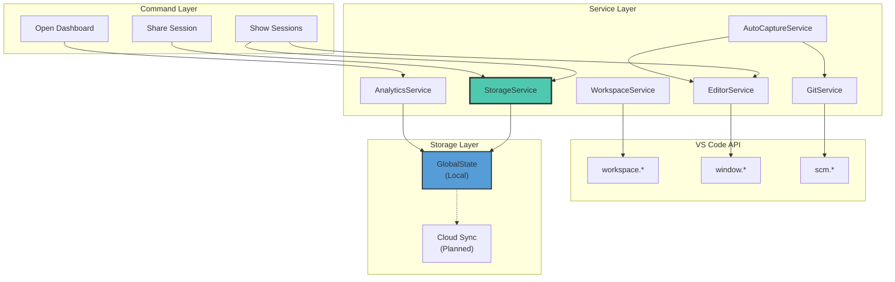
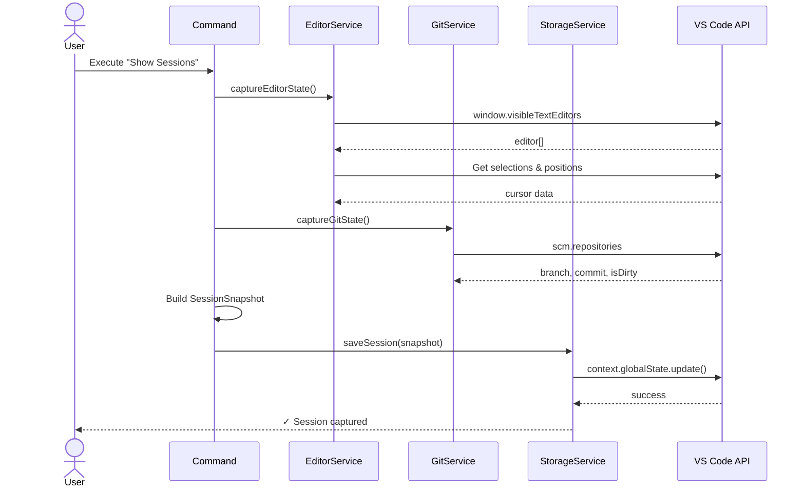
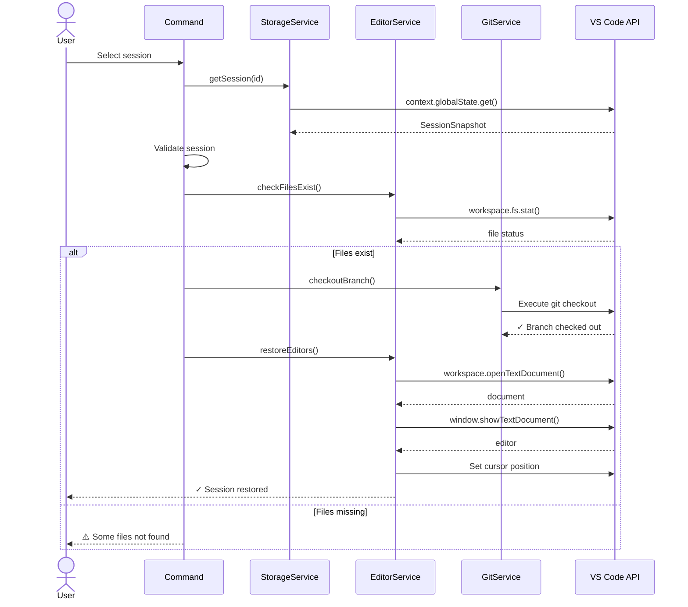
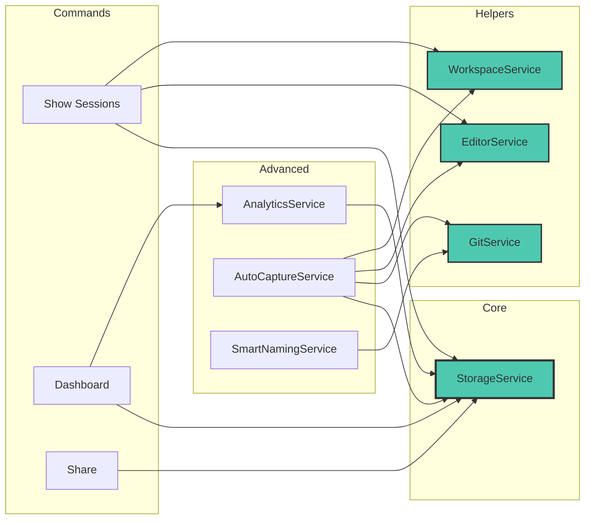
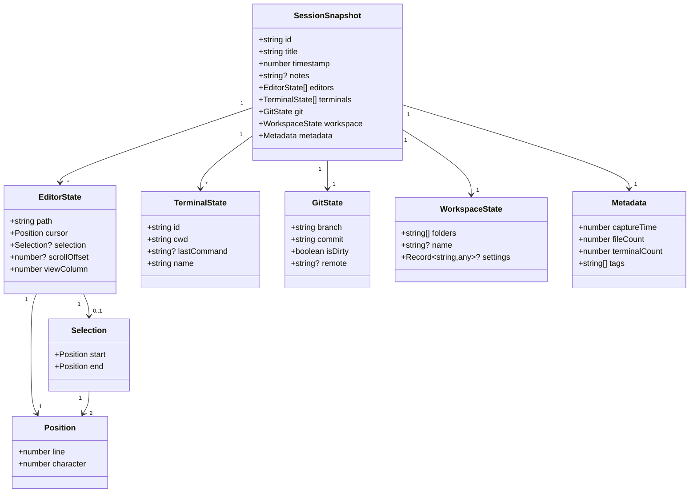

# FlowLens

[](https://marketplace.visualstudio.com/items?itemName=preston176.flowlens)
[](https://marketplace.visualstudio.com/items?itemName=preston176.flowlens)
[](./LICENSE)

Context-aware session management for VS Code. Capture and restore your complete development environment—open editors, terminal state, git context, and cursor positions.

**Links:** [Marketplace](https://marketplace.visualstudio.com/items?itemName=preston176.flowlens) | [Website](https://flowlens-vscode.vercel.app) | [Security](./.docs/SECURITY.md)

---

## Table of Contents

- [Quick Start](#quick-start)
- [Features](#features)
- [Architecture](#architecture)
- [Session Data Model](#session-data-model)
- [Configuration](#configuration)
- [Development](#development)
- [Roadmap](#roadmap)
- [License](#license)

---

## Quick Start

### Installation

```bash
code --install-extension preston176.flowlens
```

### Basic Usage

1. **Capture**: Command Palette (`Cmd+Shift+P`) → `FlowLens: Show Sessions` → Create new
2. **Restore**: `FlowLens: Show Sessions` → Select session
3. **Analytics**: `FlowLens: Open Dashboard`

**Requirements**: VS Code >= 1.104.0, Git (optional)

---

## Features

### Core Capabilities

- **Session Snapshots**: Capture editor state, terminals, git branch, and workspace folders
- **Instant Restore**: Reopen files at exact cursor positions, recreate terminals, checkout branches
- **Privacy-First**: All data stored locally in VS Code GlobalState—no code content uploaded
- **Auto-Capture**: Trigger on git branch switch, workspace change, or idle timeout
- **Analytics**: Track context switching patterns and productivity metrics

### Session Contents

- Open files with cursor positions and selections
- Terminal working directories and last commands
- Git branch, commit SHA, and dirty state
- Workspace folders and custom notes

---

## Architecture

### System Overview



### Capture Session Flow



### Restore Session Flow



### Service Dependencies



---

## Session Data Model

### Class Diagram



### TypeScript Schema

```typescript
interface SessionSnapshot {
  id: string;
  title: string;
  timestamp: number;
  notes?: string;

  editors: Array<{
    path: string;
    cursor: { line: number; character: number };
    selection?: { start: Position; end: Position };
    scrollOffset?: number;
    viewColumn: number;
  }>;

  terminals: Array<{
    id: string;
    cwd: string;
    lastCommand?: string;
    name: string;
  }>;

  git: {
    branch: string;
    commit: string;
    isDirty: boolean;
    remote?: string;
  };

  workspace: {
    folders: string[];
    name?: string;
    settings?: Record<string, any>;
  };

  metadata: {
    captureTime: number;
    fileCount: number;
    terminalCount: number;
    tags: string[];
  };
}
```

### Storage Location

- **Local**: `~/.config/Code/User/globalStorage/preston176.flowlens/sessions.json`
- **Sync** (planned): E2E encrypted, user-controlled backend

---

## Configuration

All settings are prefixed with `flowlens.*`:

```json
{
  "flowlens.autoCapture.enabled": true,
  "flowlens.autoCapture.onBranchSwitch": true,
  "flowlens.autoCapture.onIdleTime": false,
  "flowlens.autoCapture.idleMinutes": 30,
  "flowlens.autoCapture.onWorkspaceFolderChange": true,
  "flowlens.autoCapture.maxPerDay": 20,
  "flowlens.analytics.trackUsage": true
}
```

### Available Settings

| Setting | Type | Default | Description |
|---------|------|---------|-------------|
| `autoCapture.enabled` | boolean | `true` | Enable automatic session capture |
| `autoCapture.onBranchSwitch` | boolean | `true` | Capture when switching git branches |
| `autoCapture.onIdleTime` | boolean | `false` | Capture after idle period |
| `autoCapture.idleMinutes` | number | `30` | Idle threshold (5-120 minutes) |
| `autoCapture.onWorkspaceFolderChange` | boolean | `true` | Capture when workspace folders change |
| `autoCapture.maxPerDay` | number | `20` | Maximum auto-captures per day |
| `analytics.trackUsage` | boolean | `true` | Track local usage metrics |

---

## Development

### Build from Source

```bash
# Install dependencies
npm install

# Compile TypeScript
npm run compile

# Watch mode
npm run watch

# Run tests
npm test

# Create VSIX package
vsce package
```

### Project Structure

```
flowlens-vscode-extension/
├── src/
│   ├── extension.ts              # Extension entry point
│   ├── commands/                 # Command handlers
│   │   ├── openDashboard.ts
│   │   ├── showSessions.ts
│   │   └── sharingCommands.ts
│   ├── services/                 # Business logic
│   │   ├── StorageService.ts
│   │   ├── EditorService.ts
│   │   ├── GitService.ts
│   │   ├── WorkspaceService.ts
│   │   ├── AnalyticsService.ts
│   │   └── AutoCaptureService.ts
│   ├── models/
│   │   └── SessionSnapshot.ts
│   └── test/
├── dist/                         # Compiled output
└── package.json
```

### Debug Configuration

Press `F5` to launch Extension Development Host with debugging enabled.

---

## Roadmap

### v0.2.0 (Q1 2026)

- [ ] Session templates (preconfigured workspace setups)
- [ ] Diff view between sessions
- [ ] Enhanced search and filtering
- [ ] Public API for extensions

### v0.3.0 (Q2 2026)

- [ ] E2E encrypted cloud sync
- [ ] Team session sharing
- [ ] CLI tool for headless management
- [ ] Collaboration features

### v1.0.0 (Q3 2026)

- [ ] JetBrains IDE support
- [ ] Neovim plugin
- [ ] Plugin marketplace
- [ ] ML-powered productivity insights

---

## License

Proprietary. All rights reserved.

**© 2025 FlowLens Team**

For licensing inquiries, contact the development team via [GitHub Issues](https://github.com/preston176/flowlens-vscode-extension/issues).

---

## Contributing

See [CONTRIBUTING.md](./.docs/CONTRIBUTING.md) for guidelines on:

- Bug reports
- Feature requests
- Security disclosures
- Code contributions (when open-sourced)
