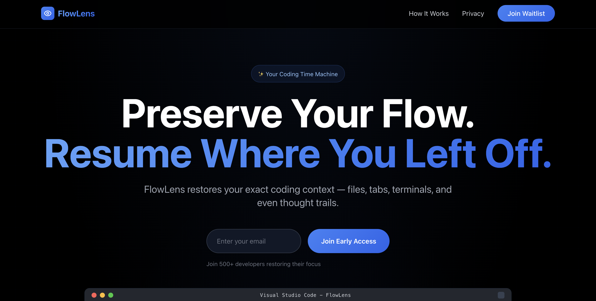
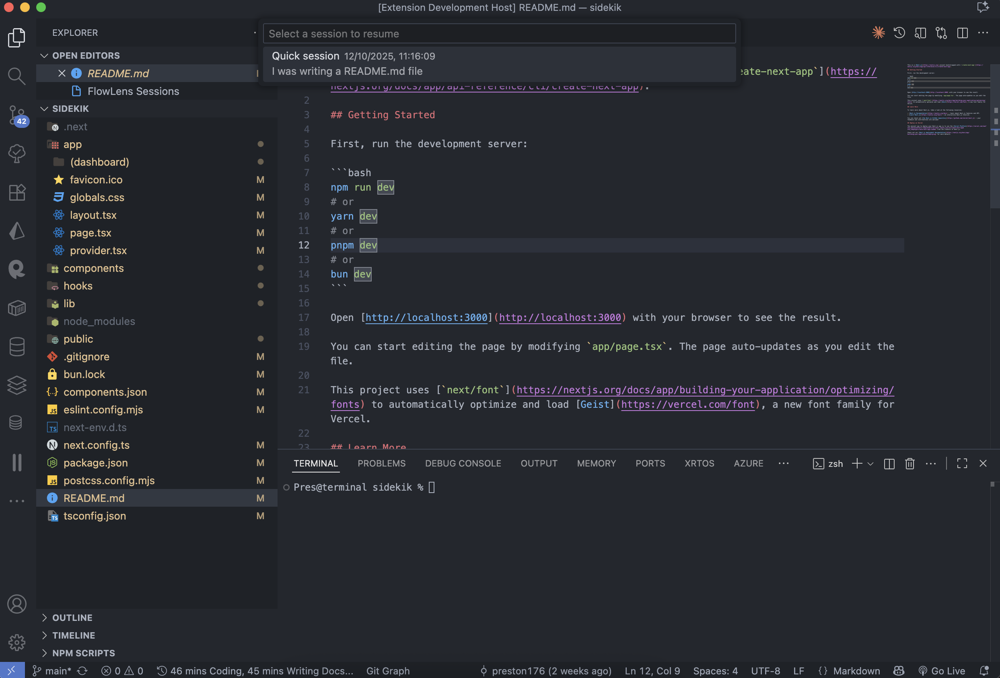
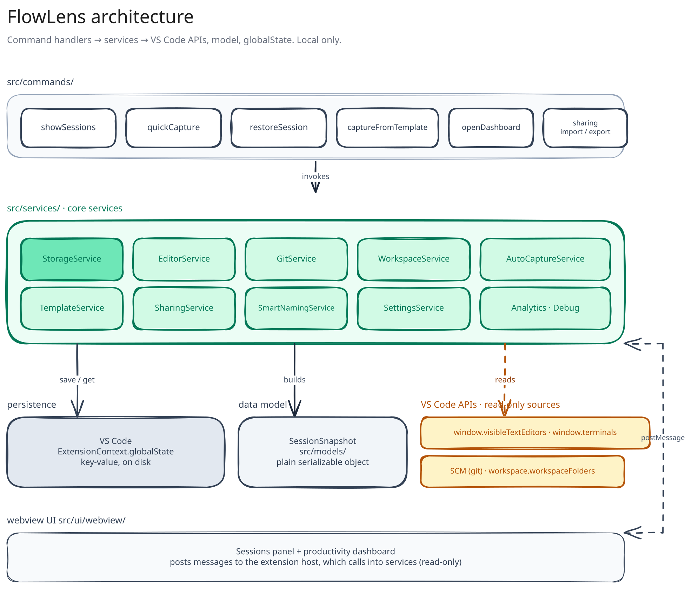
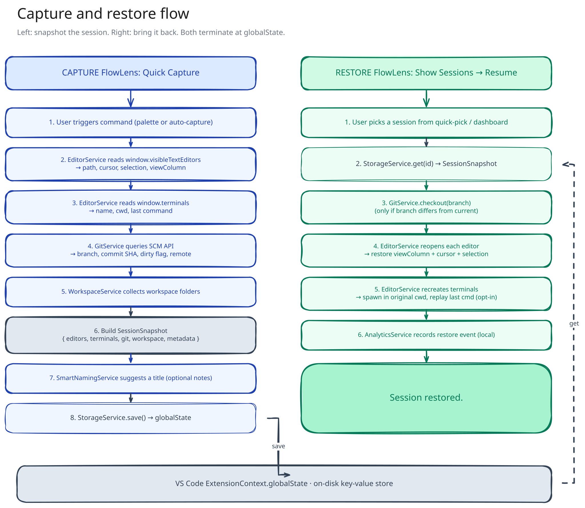
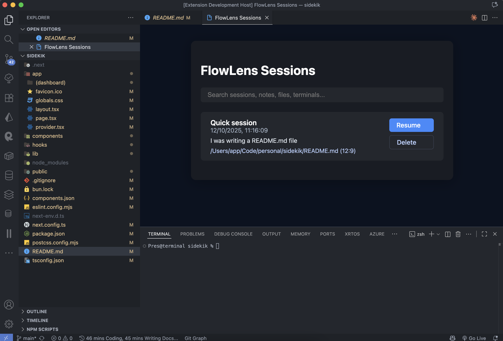
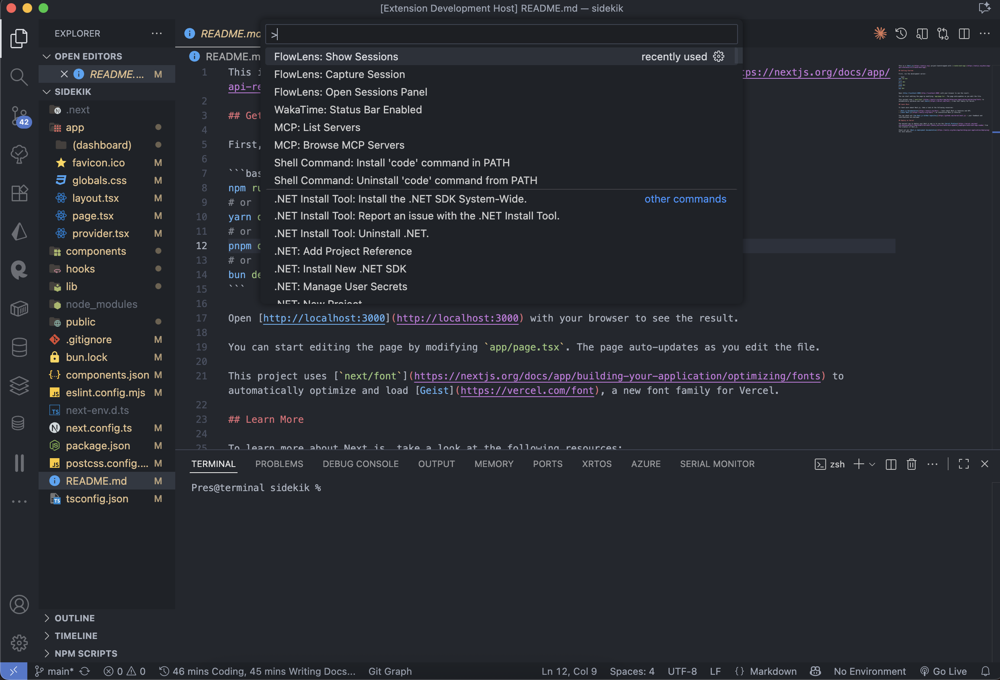

<div align="center">

  

  <h3>You switched branches. Good luck finding your tabs.</h3>

  <p>
    <strong>FlowLens captures your VS Code session — open tabs, cursor positions, terminals, git branch — and restores it in one command.</strong><br/>
    e.g. hotfix interruptions, swapping between repos, picking up yesterday's branch — without losing your place.
  </p>

  <p>
    <a href="https://marketplace.visualstudio.com/items?itemName=preston176.flowlens">
      
    </a>
  </p>

  <p>
    <sub>Free forever &nbsp;·&nbsp; Stays on your machine &nbsp;·&nbsp; No account</sub>
  </p>

  <p>
    <a href="https://marketplace.visualstudio.com/items?itemName=preston176.flowlens">
      
    </a>
    <a href="https://marketplace.visualstudio.com/items?itemName=preston176.flowlens">
      
    </a>
    <a href="https://marketplace.visualstudio.com/items?itemName=preston176.flowlens">
      
    </a>
  </p>

  <p>
    
  </p>

  <p>
    <sub><a href="https://flowlens-vscode.vercel.app">Website</a> &nbsp;·&nbsp; <a href="https://github.com/preston176/flowlens-vscode-extension/issues/new">Report a bug</a> &nbsp;·&nbsp; <a href="https://github.com/preston176/flowlens-vscode-extension/discussions">Discussions</a></sub>
  </p>

</div>

---

## Example

You're three files deep into a PR. Slack pings — prod fire. You `git checkout main`, fix it, push, come back.

Twenty minutes later you're staring at a clean editor trying to remember which seven files you had open and what line you were on.

Run `FlowLens: Show Sessions` before you context-switch:

> [!NOTE]
> **Session captured — `feat/billing-redesign`**
> 7 editors · 2 terminals · branch `feat/billing-redesign` @ `a3f9c1e`

When you come back, pick it from the list. Tabs reopen at the exact cursor positions, terminals recreate in their original `cwd`, and the branch is already checked out.

<p align="center">
  
</p>

No telemetry, no upload — everything lives in your editor's local storage.

---

## Install

| Editor | Status |
|--------|--------|
| VS Code / Cursor / Windsurf | [Visual Studio Marketplace](https://marketplace.visualstudio.com/items?itemName=preston176.flowlens) |
| VSCodium | [Download VSIX](https://github.com/preston176/flowlens-vscode-extension/releases) |
| JetBrains | Planned |
| Neovim | Not planned |

Requires VS Code **1.104+**. Git is optional but unlocks branch-aware capture.

---

## Privacy

FlowLens is the kind of tool you only trust if it stays on your machine, so:

- **What leaves your editor:** nothing. There is no backend.
- **Where sessions live:** VS Code's `globalState` on disk — same place your other extensions store settings.
- **What's recorded:** file paths, cursor positions, terminal `cwd` and last command, git branch + commit SHA, workspace folders. **Not file contents.**
- **Cloud sync:** off by default. Planned as opt-in, E2E encrypted. Until then there is no remote at all.

Storage location on disk:

```
~/.config/Code/User/globalStorage/preston176.flowlens/sessions.json    # Linux
~/Library/Application Support/Code/User/globalStorage/preston176.flowlens/  # macOS
%APPDATA%\Code\User\globalStorage\preston176.flowlens\                  # Windows
```

The full session schema and storage code is in [`src/services/StorageService.ts`](src/services/StorageService.ts) and [`src/models/SessionSnapshot.ts`](src/models/SessionSnapshot.ts). Read the source.

---

## How it works

<!-- Diagram source: Excalidraw. Edit docs/diagrams/architecture.excalidraw then export to SVG -->
<p align="center">
  
</p>

1. **Capture** reads `window.visibleTextEditors`, `window.terminals`, and the SCM API to build a `SessionSnapshot` — a plain object with paths, positions, terminal state, and git context.
2. **Store** serializes the snapshot to VS Code's `globalState`. No network, no filesystem outside the extension's storage dir.
3. **Restore** reads the snapshot, optionally checks out the recorded branch, then reopens each editor and recreates each terminal in its original `cwd`.

<!-- Diagram source: Excalidraw. Edit docs/diagrams/session-flow.excalidraw then export to SVG -->
<p align="center">
  
</p>

The whole thing is rendered in a dedicated webview — search, notes, file paths, and a one-click restore:

<p align="center">
  
</p>

The capture path is small enough to read in one sitting. Start at [`src/commands/showSessions.ts`](src/commands/showSessions.ts) and follow the `StorageService` and `EditorService` calls.

---

## What's in a session

```typescript
interface SessionSnapshot {
  id: string;
  title: string;
  timestamp: number;
  notes?: string;

  editors: Array<{
    path: string;
    cursor: { line: number; character: number };
    selection?: { start: Position; end: Position };
    scrollOffset?: number;
    viewColumn: number;
  }>;

  terminals: Array<{
    id: string;
    cwd: string;
    lastCommand?: string;
    name: string;
  }>;

  git: {
    branch: string;
    commit: string;
    isDirty: boolean;
    remote?: string;
  };

  workspace: {
    folders: string[];
    name?: string;
  };

  metadata: {
    captureTime: number;
    fileCount: number;
    terminalCount: number;
    tags: string[];
  };
}
```

---

## Commands

All commands live under the `FlowLens:` prefix in the command palette (`Cmd+Shift+P` / `Ctrl+Shift+P`):

<p align="center">
  
</p>

| Command | What it does |
|---------|--------------|
| `FlowLens: Show Sessions` | Quick-pick of saved sessions — capture new or restore existing |
| `FlowLens: Quick Capture` | Snapshot the current state with no prompts |
| `FlowLens: Restore Session` | Pick a session and restore without going through the full quick-pick |
| `FlowLens: Capture from Template` | Start from a preset (e.g. "review" — opens just the files you flag) |
| `FlowLens: Open Dashboard` | Webview with context-switching analytics |
| `FlowLens: Share Session` | Export a session as a portable JSON link |
| `FlowLens: Export Sessions` / `Import Sessions` | Bulk JSON for backup or migration |

---

## Configuration

All settings are under `flowlens.*`:

```json
{
  "flowlens.autoCapture.enabled": true,
  "flowlens.autoCapture.onBranchSwitch": true,
  "flowlens.autoCapture.onWorkspaceFolderChange": true,
  "flowlens.autoCapture.onIdleTime": false,
  "flowlens.autoCapture.idleMinutes": 30,
  "flowlens.autoCapture.maxPerDay": 20,
  "flowlens.analytics.trackUsage": true
}
```

| Setting | Default | Description |
|---------|---------|-------------|
| `autoCapture.enabled` | `true` | Master switch for automatic capture |
| `autoCapture.onBranchSwitch` | `true` | Snapshot before `git checkout` swaps your context |
| `autoCapture.onWorkspaceFolderChange` | `true` | Snapshot when folders are added/removed |
| `autoCapture.onIdleTime` | `false` | Snapshot after a quiet period |
| `autoCapture.idleMinutes` | `30` | Idle threshold (5–120) |
| `autoCapture.maxPerDay` | `20` | Cap on auto-captures so storage doesn't balloon |
| `analytics.trackUsage` | `true` | Track patterns for the dashboard. **Stays local.** |

---

## Local development

### Prerequisites

- Node 20+
- VS Code 1.104+

### Build

```bash
npm install
npm run compile        # one-shot
npm run watch          # esbuild + tsc in watch mode
```

Press `F5` in VS Code to launch the Extension Development Host with debugging attached.

### Package

```bash
npx @vscode/vsce package
# → flowlens-<version>.vsix
```

### Test

```bash
npm test
```

---

## Repo layout

```
flowlens-vscode-extension/
├── src/
│   ├── extension.ts              # Activation + command registration
│   ├── commands/                 # Command handlers
│   ├── services/                 # StorageService, EditorService, GitService, …
│   ├── models/                   # SessionSnapshot + related types
│   └── test/
├── website/                      # Marketing site (flowlens-vscode.vercel.app)
├── demo/                         # Scripted demo runner
├── docs/                         # Diagrams, screenshots, dev notes
└── builds/                       # Historical VSIX builds
```

---

## Contributing

Issues and PRs welcome. Two things to know:

1. **Bug reports need a repro session.** "Restore didn't work" is unactionable. The session JSON (you can export it) plus the OS and VS Code version pin it down in seconds.
2. **No new capture surfaces without a use case.** Every field added to the snapshot is one more thing to migrate forever. Open an issue first.

See [CONTRIBUTING.md](./.docs/CONTRIBUTING.md) and [SECURITY.md](./.docs/SECURITY.md) for the rest.

---

## What's next

- Session templates — preconfigured workspace setups for recurring tasks (code review, on-call, etc.)
- Diff between two sessions — see what your context actually looked like a week ago
- Opt-in E2E encrypted cloud sync — pick your own backend, hold your own keys

Everything else on the wishlist is "maybe."

---

## License

Proprietary. All rights reserved.

For licensing inquiries, open a [GitHub issue](https://github.com/preston176/flowlens-vscode-extension/issues).
